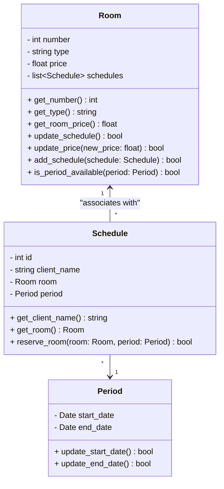

# Seminar of Software Engineer
Basic project that implement tests with [Pytest](https://docs.pytest.org/en/stable/) and poetry dependence manager into a hotel reservation system.

## Team
- Pedro Luis
- Arthur Bueno
- Pedro Augusto
- Marcos Henrique

## Requirements
- Chrome extension to view mermaid diagrams: [Mermaid Previewer](https://chromewebstore.google.com/detail/mermaid-previewer/oidjnlhbegipkcklbdfnbkikplpghfdl?utm_source=ext_app_menu)
- Python 3.12

## Architecture

